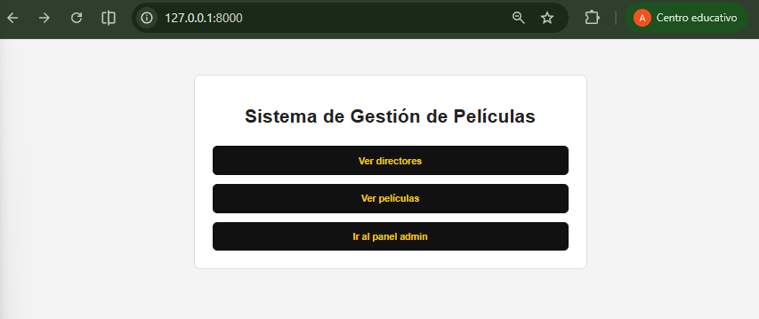
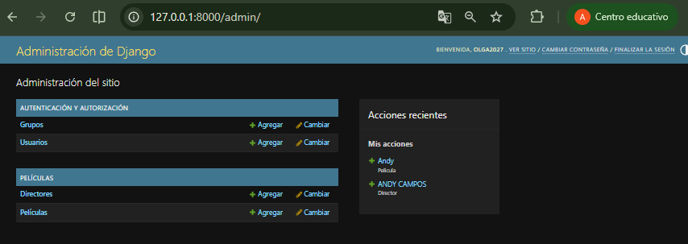
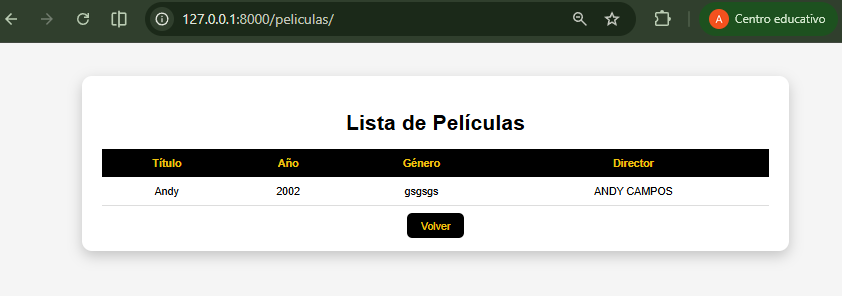
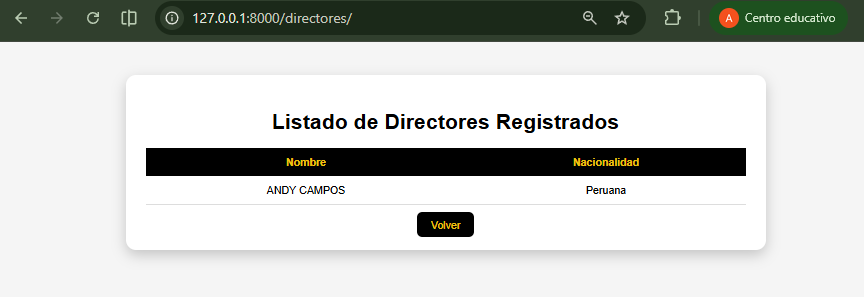

# Sistema de Gestión de Películas

Proyecto desarrollado en Django que permite gestionar información de directores y películas mediante un panel administrador y vistas de consulta.

## Inicio del sistema

## Panel Administrador

## Lista de Películas

## Lista de Directores
